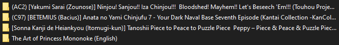

# eh_download
dgeh, Download Gallery E-hentai.

GUI gallery downloader for e-hentai

Once you downloaded all the files you want, I suggest using this script : https://gist.github.com/toiletclogger69/d08164cd8c978f7a1fc2f12ee9e4f15a to easily read the gallery afterward.

## **DOWNLOAD THE EXE HERE [dgeh.zip](https://github.com/toiletclogger69/eh_download/files/9203909/dgeh.zip)**

## requirements (as an exe)
None, just click on the exe

## requirements (as a python script)
```
pip install gooey requests bs4
```

---

## Screenshots :
The GUI : 


The result of downloading 4 gallery :



In each folder every picture :


---

## Fields
**Text area** : Put a list of url inside the box, eg:
```
https://e-hentai.org/g/lots_of_number1/lots_of_number1/
https://e-hentai.org/g/lots_of_number2/lots_of_number2/
https://e-hentai.org/g/lots_of_number3/lots_of_number3/
```

It only accept url from e-hentai (eg : https://e-hentai.org/g/lots_of_number/lots_of_number/).

**Replace character** : Remove every | ? ! / and other character that are not accepted in window folder name.

## Use a standalone script
Go into [eh.py](eh.py), set `TRUE_IF_CLI` to True.

Add a text file named "urls.txt" in your current folder, put every urls inside then execute the script with "python eh.py".

## How to build the exe
`pip install pyinstaller`

go into the current folder >

`pyinstaller --onefile --noconsole eh.py`
